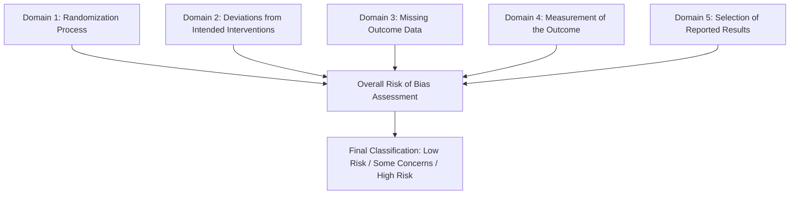

# Cochrane Risk of Bias 2 (RoB 2) Quality Assessment Template & Protocol

- **Review Title**: Protocol characteristics associated with clinically meaningful 24-hour opioid sparing from perioperative transcutaneous electrical acupoint stimulation and electroacupuncture: a systematic review and meta-regression of randomized controlled trials
- **Review ID**: PROSPERO / Covidence Review #799962 (Lund University)
- **Tool**: Cochrane Risk of Bias 2 (RoB 2) Tool for Individually Randomized Parallel-Group Trials
- **Guidance Reference**: Sterne JAC, Savović J, Page MJ, et al. RoB 2: a revised tool for assessing risk of bias in randomised trials. *BMJ* 2019;366:l4898.

---

## 1. Structure of the RoB 2 Quality Assessment Tool

The tool assesses risk of bias across **5 core bias domains** plus an **overall risk-of-bias judgment** for each trial:



---

## 2. Domain-by-Domain Signaling Questions & Criteria

### Domain 1: Risk of bias arising from the randomization process
* **Signaling Question 1.1**: *Was the allocation sequence random?*
  - **Yes (Y)**: Computer-generated random numbers, coin toss, random number table, permuted block randomization, minimization.
  - **Probably Yes (PY)**: Described as "randomly assigned" in a peer-reviewed RCT without detailed algorithmic specification, where trial registration confirms computerized randomization.
  - **Probably No (PN) / No (N)**: Alternation, hospital admission numbers, date of birth, day of the week (quasi-randomized).
  - **No Information (NI)**: Allocation method omitted and unable to ascertain.
* **Signaling Question 1.2**: *Was the allocation sequence concealed until participants were enrolled and assigned to interventions?*
  - **Y / PY**: Sequentially numbered opaque sealed envelopes (SNOSE), central web-based / pharmacy allocation, independent statistician concealment.
  - **PN / N**: Open lists, unsealed envelopes, knowledge of sequence by treating clinicians prior to consent.
  - **NI**: Method of sequence concealment not reported.
* **Signaling Question 1.3**: *Did baseline differences between intervention groups suggest a problem with the randomization process?*
  - **N / PN**: Baseline demographic, clinical, and surgical characteristics well balanced between groups, or minor differences compatible with chance.
  - **Y / PY**: Substantial, statistically significant baseline imbalance in key prognostic variables (e.g. age, surgical complexity, baseline pain) suggesting failed allocation concealment.
* **Domain 1 Judgment**:
  - **Low Risk**: Adequate random sequence generation AND adequate concealment AND no baseline imbalances.
  - **Some Concerns**: Randomization or concealment described with minor ambiguity (NI for 1.2) but no evidence of baseline problem.
  - **High Risk**: Inadequate sequence generation OR open allocation OR severe unexplained baseline prognostic imbalance.

---

### Domain 2: Risk of bias due to deviations from the intended interventions
*(Effect of assignment to intervention — intention-to-treat perspective)*
* **Signaling Question 2.1**: *Were participants aware of their assigned intervention during the trial?*
  - **N / PN**: Inactive / sub-sensory sham TEAS with identical surface electrode pads and mock indicators, or non-penetrating sham EA needles (Streitberger / Park sham) with confirmed blinding credibility.
  - **Y / PY**: Open-label / no-stimulation / usual-care control group where patients were overtly aware of receiving no acupoint stimulation.
* **Signaling Question 2.2**: *Were carers and people delivering the interventions aware of participants' assigned intervention during the trial?*
  - **N / PN**: Double-blind setup where identical stimulators / sham leads were prepared by an independent researcher, and ward/PACU nurses and surgeons were blinded.
  - **Y / PY**: Open-label or unblinded acupuncturists/anesthesiologists where knowledge of assignment could affect co-interventions.
* **Signaling Question 2.3**: *Were there deviations from the intended intervention that arose because of the trial context?*
  - **N / PN**: Protocol adhered to without substantial co-intervention contamination.
  - **Y / PY**: Unbalanced rescue analgesics, regional blocks, or protocol violations differential between groups.
* **Signaling Question 2.4**: *Were these deviations balanced between groups and unlikely to have affected the outcome?*
* **Signaling Question 2.5**: *Was an appropriate analysis used to estimate the effect of assignment to intervention?*
  - **Y / PY**: Full intention-to-treat (ITT) analysis or modified ITT with all randomized participants accounted for.
  - **PN / N**: Per-protocol analysis with substantial non-random participant exclusions (>10%).
* **Domain 2 Judgment**:
  - **Low Risk**: Double-blind sham-controlled RCT with blinding of participants and clinicians, or open-label design where co-interventions and background multimodal care were strictly standardized and ITT analysis applied.
  - **Some Concerns**: Minor unblinded context with standardized analgesia protocol, or slight post-randomization dropout without imputation.
  - **High Risk**: Overt lack of blinding coupled with substantial co-intervention imbalances and selective per-protocol exclusions.

---

### Domain 3: Risk of bias due to missing outcome data
* **Signaling Question 3.1**: *Were data for this outcome available for all, or nearly all, participants randomized?*
  - **Y / PY**: Complete outcome data available for >= 95% of randomized participants (or 0 dropouts).
  - **PN / N**: Substantial post-randomization attrition (> 10% missing) without justification.
* **Signaling Question 3.2**: *Is there evidence that the result was not biased by missing outcome data?*
  - **Y / PY**: Dropouts balanced, reasons documented, unrelated to true pain/opioid levels, or robust multiple imputation performed.
* **Signaling Question 3.3**: *Could missingness in the outcome depend on its true value?*
  - **N / PN**: Missingness random / administrative (e.g. early hospital discharge, technical monitor failure).
  - **Y / PY**: Missingness due to severe adverse events, treatment failure, or uncontrolled pain.
* **Domain 3 Judgment**:
  - **Low Risk**: No missing data or minimal missing data (< 5%) balanced across arms.
  - **Some Concerns**: 5–10% missing data with plausible missing-at-random justifications.
  - **High Risk**: > 10% missing data with differential attrition or dropouts related to treatment efficacy.

---

### Domain 4: Risk of bias in measurement of the outcome
* **Signaling Question 4.1**: *Was the method of measuring the outcome inappropriate?*
  - **N / PN**: Validated electronic IV PCA pump data collection for opioid consumption; validated VAS (0–10 / 0–100) or NRS (0–10) pain assessment.
  - **Y / PY**: Subjective non-validated scoring or uncalibrated measurements.
* **Signaling Question 4.2**: *Could measurement or ascertainment of the outcome have differed between intervention groups?*
  - **N / PN**: Identical PCA pump programming, identical pain recording schedules in PACU and surgical ward across all arms.
* **Signaling Question 4.3**: *Were outcome assessors aware of the intervention received by study participants?*
  - **N / PN**: Independent blinded research observers, ward nurses, and PACU assessors collecting pain scores and PCA log data.
  - **Y / PY**: Unblinded assessors recording subjective pain scores.
* **Signaling Question 4.4**: *Could assessment of the outcome have been influenced by knowledge of intervention received?*
  - **N / PN**: For objective electronic PCA pump cumulative opioid logs, bias is minimal; for subjective pain scores, assessors were blinded.
* **Domain 4 Judgment**:
  - **Low Risk**: Blinded outcome assessment OR objective electronic PCA pump data collection.
  - **Some Concerns**: Unblinded subjective pain assessment in the presence of standardized protocols.
  - **High Risk**: Unblinded subjective assessment with high risk of observer bias.

---

### Domain 5: Risk of bias in selection of the reported result
* **Signaling Question 5.1**: *Were the data that produced this result analyzed in accordance with a pre-specified analysis plan that was finalized before unblinded outcome data were available?*
  - **Y / PY**: Prospective trial registration (e.g. ChiCTR, ClinicalTrials.gov, ANZCTR) with prespecified 24-h opioid and pain endpoints.
  - **NI**: Trial registration retrospective or missing, but reporting standard predefined acute postoperative intervals.
* **Signaling Question 5.2**: *Is the numerical result being assessed likely to have been selected from multiple outcome measurements within the outcome domain?*
  - **N / PN**: Primary 24-hour interval clearly reported without selective timepoint cherry-picking.
* **Signaling Question 5.3**: *Is the numerical result being assessed likely to have been selected from multiple analyses of the data?*
  - **N / PN**: Standard parametric/non-parametric tests applied as prespecified.
* **Domain 5 Judgment**:
  - **Low Risk**: Prospectively registered trial with all prespecified outcomes fully reported.
  - **Some Concerns**: Trial registration absent or retrospective, but all expected core outcomes (opioids, rest pain, dynamic pain, PONV) reported without evidence of selective omissions.
  - **High Risk**: Clear evidence of selective reporting (e.g. measured outcomes omitted because of non-significant P-values).

---

## 3. Overall Risk of Bias Algorithm

```text
Overall Judgement Criteria:
- Low Risk: Study is judged to be at Low Risk of bias for ALL 5 domains.
- Some Concerns: Study is judged to raise Some Concerns in AT LEAST ONE domain, but is NOT at High Risk in any domain.
- High Risk: Study is judged to be at High Risk of bias in AT LEAST ONE domain, OR has Some Concerns for multiple domains in a way that substantially lowers confidence in the result.
```

---

## 4. Master Quality Assessment Data Matrix (Template Structure)

The master CSV matrix to be populated for all 74 studies is structured as follows:

| Column Name | Description | Permitted Values |
|---|---|---|
| `study_id` | Covidence Study ID | Integer (e.g. `1879896688`) |
| `study_key` | Study Label | String (e.g. `#480 - Chen 2020`) |
| `author_year` | Primary Author and Year | String (e.g. `Chen 2020`) |
| `modality` | Intervention Modality | `TEAS` / `EA` |
| `comparator` | Comparator Classification | `Sham` / `Usual Care` / `No Stimulation` |
| `d1_random_sequence` | 1.1 Random sequence generation | `Y` / `PY` / `PN` / `N` / `NI` |
| `d1_allocation_concealment` | 1.2 Allocation concealment | `Y` / `PY` / `PN` / `N` / `NI` |
| `d1_baseline_balance` | 1.3 Baseline balance | `N` / `PN` / `PY` / `Y` / `NI` |
| `d1_judgment` | **Domain 1 Bias Judgment** | **Low** / **Some concerns** / **High** |
| `d2_participant_blinding` | 2.1 Participant awareness | `N` / `PN` / `PY` / `Y` / `NI` |
| `d2_personnel_blinding` | 2.2 Personnel awareness | `N` / `PN` / `PY` / `Y` / `NI` |
| `d2_protocol_deviations` | 2.3 Contextual deviations | `N` / `PN` / `PY` / `Y` / `NI` |
| `d2_itt_analysis` | 2.5 Appropriate ITT analysis | `Y` / `PY` / `PN` / `N` / `NI` |
| `d2_judgment` | **Domain 2 Bias Judgment** | **Low** / **Some concerns** / **High** |
| `d3_data_completeness` | 3.1 Outcome data completeness | `Y` / `PY` / `PN` / `N` / `NI` |
| `d3_missing_not_biased` | 3.2 Evidence against missingness bias | `Y` / `PY` / `PN` / `N` / `NI` |
| `d3_judgment` | **Domain 3 Bias Judgment** | **Low** / **Some concerns** / **High** |
| `d4_measurement_validity` | 4.1 Appropriate outcome measurement | `N` / `PN` / `PY` / `Y` / `NI` |
| `d4_assessor_blinding` | 4.3 Outcome assessor awareness | `N` / `PN` / `PY` / `Y` / `NI` |
| `d4_judgment` | **Domain 4 Bias Judgment** | **Low** / **Some concerns** / **High** |
| `d5_selective_reporting` | 5.1 Prespecified protocol & plan | `Y` / `PY` / `PN` / `N` / `NI` |
| `d5_outcome_selection` | 5.2 Selective timepoint/measure selection | `N` / `PN` / `PY` / `Y` / `NI` |
| `d5_judgment` | **Domain 5 Bias Judgment** | **Low** / **Some concerns** / **High** |
| `overall_rob` | **OVERALL RISK OF BIAS** | **Low** / **Some concerns** / **High** |
| `rob_support_rationale` | Qualitative Support Rationale | Text string summarizing key evidence |

